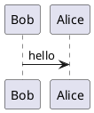

# Title {data-background=black data-background-image=assets/img/background-title-16x9.png}

with a catchy subtitle here&#8230;

<small> Author | Date | etc </small>

{height=80px}


# {data-background-image=assets/img/background-orange-orig.jpg}


# First Slide {data-background-image=assets/img/background-green-orig.jpg}




# Second Slide {data-background=black data-background-image=assets/img/background-violet-orig.jpg data-background-size=cover}

## Subslide A

```ditaa
    +--------+   +-------+    +-------+
    |        | --+ ditaa +--> |       |
    |  Text  |   +-------+    |diagram|
    |Document|   |!magic!|    |   a   |
    |     {d}|   |       |    |       |
    +---+----+   +-------+    +-------+
        :                         ^
        |       Lots of work      |
        +-------------------------+
```

## Subslide B &#x1f60E;


# "Hands-on" {data-background=black data-background-image=assets/img/background-title-16x9.png}

<asciinema-player
    src="./assets/img/test.json"
    poster="npt:0:21"
    idle-time-limit=1
    speed=2
    rows=18
    font-size="medium"
></asciinema-player>


# Any Questions? {data-background=black data-background-image=assets/img/paperclip.gif data-background-size=cover}


# Thank You! {data-background-color=black data-background-image=assets/img/background-title-16x9.png}


<script src="lib/asciinema/asciinema-player.js"></script>
